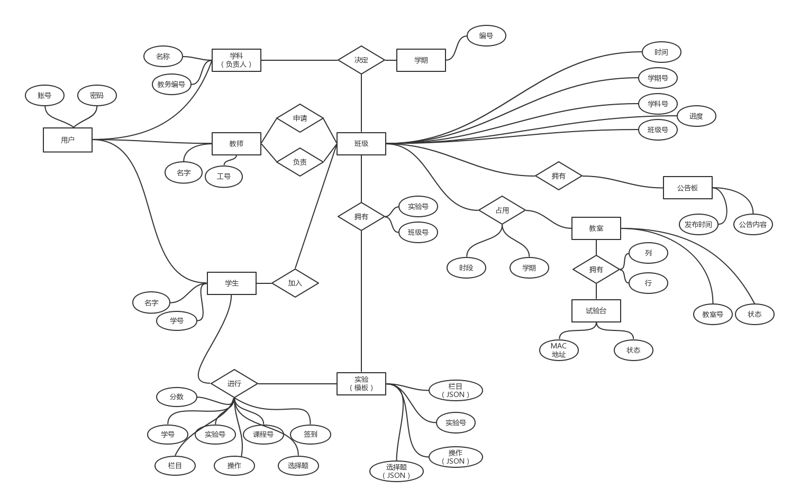

### 电子实验管理系统需求分析

为实验中心设计一套实验管理系统，包括成绩管理、考勤、课程安排等功能

-----------------
#### 分角色功能
管理员：
1. 对群体发送公告，通知定位到具体班级上
2. 查看课程的排课情况和教室的使用情况
3.	手动增加、修改课程负责人、实验课程、教师、学生
4.	导入本学期的所有教务安排的固有课程、学生（电子表格由教务处提供）
4.	导出本学期的所有报告

课程负责人：
1.	对该课程下的班级群体发送公告
2.	查看所负责的课程的排课情况
3.	发布、查看、审核老师的带课申请
4.	发布、查看、编辑报告模板（编辑报告内容包括：文字、表格（按图片方式存在）、图像文件、视频文件等）
6.	查看各班级的学生的签到信息

教师：
1.	查看已发布的需要招募老师的课程，并递交申请
2.	查看自己的课表
4.	查看并批阅报告；对学生的预习、报告、大作业、考试等进行打分
5.	查看自己带课教学班级学生实验的分数
6.	查看代课班级学生的签到信息
7.	对操作各题成绩进行现场扫描学生二维码打分或补登成绩
8.	学期结束时生成成绩单

学生：
1.	查看自己的课表
2.	查看报告；实验课前对预习作业进行递交
3.	老师开始上课后，对课程中的某个实验进行签到开始上电，实验完成后对实验各题结果进行递交；实验课结束后签离，切断电源
4. 课后能对实验报告进行编辑填写（允许对虚拟测量软件的测量结果截图粘贴、填写表格、粘贴图像文件、粘贴视频文件等操作）、递交
5.	查看自己的各门实验课的分数（含操作的小题分

ER图

### 知情声明

本软件开发需求双方以明确并知晓，开发者需按期实现功能，并每周汇报进度，委托方在开发过程中不应更改需求，否则因此造成的延期由委托方自行承担。

#### 委托方：

#### 开发方：